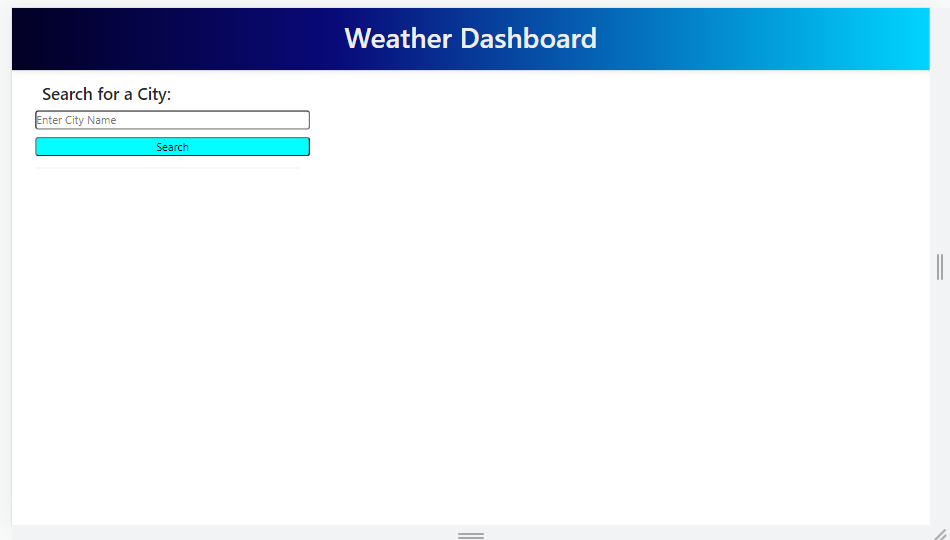
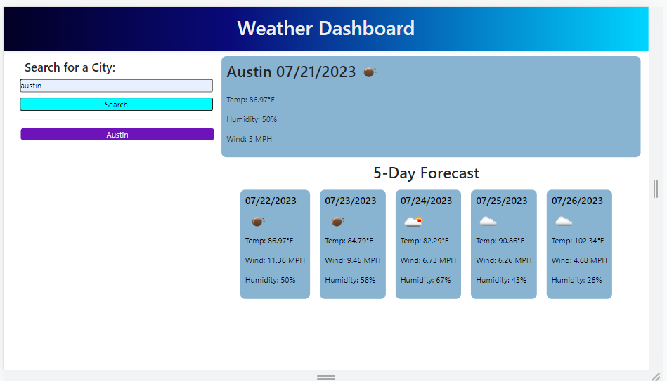
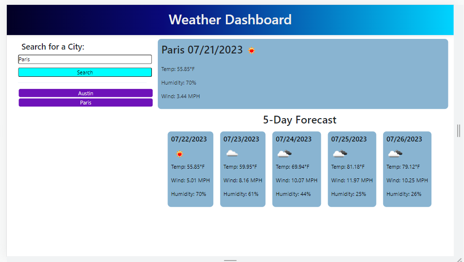

# Weather-Dashboard

## Description
The purpose of this project was to allow a user to get the current weather as well as the weather for the next few
days for a given city. I built this to gain experience working with api calls. 

## Installation

N/A

## Usage

You begin on the home page above and are able to click into the search bar and type in the city of your choice to grab the
current weather data as well as the data for the next five days.

After you hit search your results will appear and a history of your searches will automatically populate below the search
bar. If you want to search for a city again, you can just click the city in the history.

## License

Refer to LICENCE in repo.
